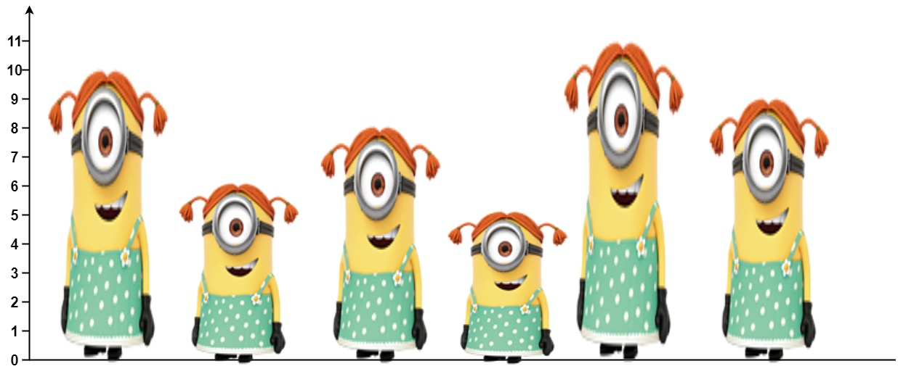

# Стек
  
### Определение
  Линейна струкутра от данни с последователен достъп. 
  
### Абстракна структура
```cpp
     */
template <typename T>
class StackInterface {
public:
    virtual ~StackInterface() = default;

    virtual void push(const T& element) = 0;
    virtual T pop() = 0;
    virtual const T& top() const = 0;
    virtual bool isEmpty() const = 0;

    virtual size_t size() const = 0;
};
```

### Реализация:
  - Статична (Fixed Size) 
  - Свързан списък
  - Динамиѝен Масив

### Задачи

#### 1. Най-дълбоко вложени скоби [LeetCode](https://leetcode.com/problems/maximum-nesting-depth-of-the-parentheses) 

#### 2. Валидация с 3 вида скоби [LeetCode](https://leetcode.com/problems/valid-parentheses/)

`((() ()))     --> valid`
`( ) { () }  ( [[]] )  --> valid`

#### 3. Разгъване на най-външните скоби [LeetCode](https://leetcode.com/problems/remove-outermost-parentheses/)
)
`((() ()))     --> (() ())`
`()(())((()))  -->  ()(())`
 
#### 4. Инфиксен запис към Обратен полски запис (Shunting Yard Algorithm)


#### 5. Мин/Макс Стек (Const time)
Реализирайте структура от данни стек с допълнителна операция `int getMin() / int getMax`, която връща минималният елемент в структурата.
Всички операции в стека трябва да бъдат реализирани с константна времева сложност.

#### 6. Брой видими хора видими в опашка
 